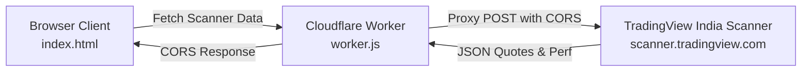

# 📊 Daily ETF Performance vs NIFTY

A sleek, responsive market dashboard tracking Indian Exchange-Traded Funds (ETFs) and comparing their returns against the benchmark **NIFTY 50** across multiple timeframes (1D, 1W, 1M, 3M, 6M).

[](https://github.com/johndoe775/stocks_details/actions/workflows/deploy.yml)
[](LICENSE)
[](https://workers.cloudflare.com/)

---

## ✨ Features

- **Benchmark Comparison**: Benchmarks performance against `NSE:NIFTY` across 1-day, 1-week, 1-month, 3-month, and 6-month horizons.
- **Hierarchical Sorting**: ETFs are automatically sorted by momentum: 6M → 3M → 1M → 1W → 1D returns.
- **Visual Relative Performance**: Contextual color coding based on return positivity and outperformance/underperformance versus NIFTY.
- **Responsive Dark Mode UI**: Modern card and table layouts optimized for desktop monitors, tablets, and mobile devices.
- **Zero-Dependency Frontend**: Pure HTML5, CSS3, and modern vanilla JavaScript — lightweight, fast, and dependency-free.
- **Secure Secret Injection**: GitHub Actions workflow injects the Cloudflare Worker URL during deployment without committing endpoints directly into source control.

---

## 🎨 Relative Performance Matrix

Each ETF's performance cell is styled according to its performance relative to the NIFTY benchmark:

| Return Type | vs. NIFTY Benchmark | Cell Appearance | Meaning |
| :--- | :--- | :--- | :--- |
| **Positive (`≥ 0%`)** | **Outperforming (`≥ NIFTY`)** | 🟢 Green (`#ccffcc`) | Strong outperformance |
| **Positive (`≥ 0%`)** | **Underperforming (`< NIFTY`)** | 🟡 Yellow (`#fff2cc`) | Positive, but lagged market |
| **Negative (`< 0%`)** | **Outperforming (`≥ NIFTY`)** | 🔴 Light Red (`#ffcccc`) | Negative, but beat market downturn |
| **Negative (`< 0%`)** | **Underperforming (`< NIFTY`)** | 🚨 Dark Red (`#8B0000`) | Severe underperformance |

*Note: The **NIFTY** benchmark row is styled neutrally to serve as the baseline.*

---

## 📈 Tracked Assets

The dashboard tracks major thematic, sectoral, factor, and international ETFs traded on the NSE:

| Category | Symbols / ETFs |
| :--- | :--- |
| **Benchmark** | `NIFTY 50` (`NSE:NIFTY`) |
| **Broad & Factor** | `NIFTY100EW`, `MID150CASE` |
| **Commodities** | `TATAGOLD` |
| **Sectoral & Thematic** | `AUTOIETF`, `ECAPINSURE`, `FMCGIETF`, `HEALTHY`, `INFRAIETF`, `IT` (`ITBEES`), `METALIETF`, `MOCAPITAL`, `MOREALTY`, `OILIETF`, `PHARMABEES`, `PSUBNKBEES`, `PVTBANKADD`, `ABSLPSE` |
| **International** | `MAFANG` (US Big Tech), `MON100` (Nasdaq 100) |

---

## 🏗️ Architecture



- **Client (`index.html`)**: Requests performance metrics, sorts rows, evaluates relative performance against NIFTY, and renders desktop tables or mobile cards.
- **CORS Proxy (`worker.js`)**: Runs on the edge via Cloudflare Workers to forward requests safely to TradingView's India scanner with CORS headers and rate limiting.
- **CI/CD (`.github/workflows/deploy.yml`)**: Injects the Cloudflare Worker URL into `index.html` via GitHub Actions and publishes to GitHub Pages.

---

## 🚀 Getting Started

### 1. Local Development

You can run the dashboard locally with any static web server:

```bash
# Clone the repository
git clone https://github.com/johndoe775/stocks_details.git
cd stocks_details

# For local testing, temporarily replace __CLOUDFLARE_WORKER_URL__ in index.html with your active worker URL
# or test using python's built-in web server:
python3 -m http.server 8000
```
Open `http://localhost:8000` in your browser.

---

### 2. Deploying the Cloudflare Worker

1. Install Wrangler CLI (if not already installed):
   ```bash
   npm install -g wrangler
   wrangler login
   ```
2. Deploy the proxy worker:
   ```bash
   wrangler deploy worker.js --name tradingview-cors-proxy
   ```
3. Note your generated Worker URL:
   ```
   https://tradingview-cors-proxy.<your-subdomain>.workers.dev
   ```

---

### 3. Setting Up GitHub Pages & Automated Deployment

1. **Enable GitHub Pages**:
   - In your repository, go to **Settings** > **Pages**.
   - Under **Build and deployment** > **Source**, choose **GitHub Actions**.

2. **Add the Worker Secret**:
   - Go to **Settings** > **Environments**.
   - Select or create the `github-pages` environment.
   - Under **Environment secrets**, click **Add secret**:
     - **Name**: `CLOUDFLARE_WORKER_URL`
     - **Value**: `https://YOUR-WORKER.YOUR-SUBDOMAIN.workers.dev`

3. **Deploy**:
   - Push to `main` branch. GitHub Actions will inject the secret into `index.html` and deploy your dashboard automatically.

---

## 📁 Repository Structure

```
stocks_details/
├── .github/
│   └── workflows/
│       └── deploy.yml      # CI/CD: Secret injection & GitHub Pages deployment
├── index.html              # Responsive dashboard UI & calculation logic
├── worker.js               # Cloudflare Worker CORS proxy for TradingView
├── Makefile                # Git sync convenience commands
├── LICENSE                 # MIT License
└── README.md               # Project documentation
```

---

## 📄 License

This project is licensed under the [MIT License](LICENSE).